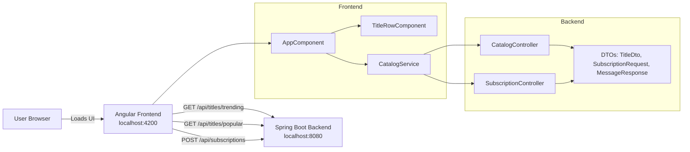

# Netflix Clone (Angular + Java)

A full-stack Netflix-inspired clone with:

- **Frontend:** Angular (standalone components)
- **Backend:** Java 17 + Spring Boot REST API

## Project structure

- `frontend/` Angular app for the UI
- `backend/` Spring Boot API for catalog and subscription endpoints

## Technical architecture diagram



## Architecture explanation

The application follows a simple two-tier client-server architecture:

1. **Presentation layer (Angular frontend)**
   - The browser loads the Angular app served on `http://localhost:4200`.
   - `AppComponent` handles page layout, form interactions, and orchestration.
   - `TitleRowComponent` is a reusable presentational component used for content rows.
   - `CatalogService` is responsible for all HTTP communication with backend APIs.

2. **API layer (Spring Boot backend)**
   - The backend runs on `http://localhost:8080`.
   - `CatalogController` exposes read-only endpoints for title rows.
   - `SubscriptionController` accepts subscription requests and validates email input.
   - DTO records (`TitleDto`, `SubscriptionRequest`, `MessageResponse`) define clear request/response contracts between frontend and backend.

3. **Integration flow**
   - Frontend calls `/api/titles/trending` and `/api/titles/popular` to render catalog rows.
   - Frontend posts email data to `/api/subscriptions` for the CTA form.
   - During local development, Angular proxy configuration forwards `/api/*` requests to the backend.

4. **Cross-origin/dev ergonomics**
   - Backend CORS configuration allows requests from `http://localhost:4200`.
   - Frontend proxy config simplifies local integration by avoiding manual URL switching during dev.

## Backend setup

```bash
cd backend
./mvnw spring-boot:run
```

If Maven Wrapper is not present, use:

```bash
mvn spring-boot:run
```

Backend runs at `http://localhost:8080`.

## Frontend setup

```bash
cd frontend
npm install
npm start
```

Frontend runs at `http://localhost:4200` and proxies `/api` requests to the backend.

## API endpoints

- `GET /api/titles/trending`
- `GET /api/titles/popular`
- `POST /api/subscriptions` with body `{ "email": "name@example.com" }`
